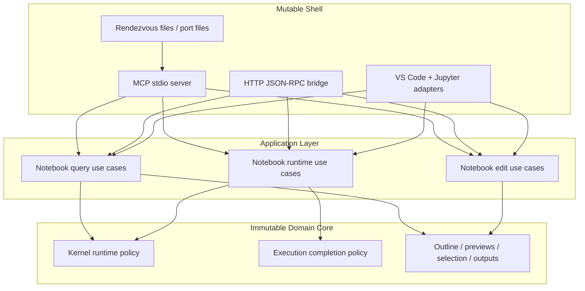
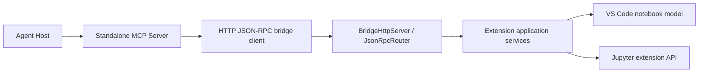

# Architecture

This repository follows an onion-style architecture:

- immutable core in the center
- application orchestration around it
- mutable adapters and transports at the edge

The goal is to keep notebook policy stable and testable while isolating VS Code,
Jupyter, HTTP, MCP, files, timers, and logging to the shell.

## Layers

### 1. Domain Core

The core owns pure decisions and stable data transformations.

Examples:

- kernel runtime transitions
- execution completion policy
- notebook outline and preview derivation
- output classification and normalization policy
- cell selection and line-span computation

Rules:

- no VS Code APIs
- no file system
- no HTTP or MCP transport
- no timers, subscriptions, or logging side effects

These modules should be unit-testable with plain inputs and outputs.

### 2. Application Layer

The application layer coordinates use cases against ports and mutable state.

Examples:

- open notebook
- read targeted cells
- apply edits with optimistic version checks
- execute cells and wait for completion
- request kernel selection or restart

Rules:

- may depend on domain core
- may depend on abstracted host services
- should not contain transport-specific concerns
- should be organized by use case, not by protocol

This layer is allowed to manage workflow state, but it should avoid embedding
policy that belongs in the core.

### 3. Adapters

Adapters connect the application layer to the real world.

Extension-side examples:

- VS Code notebook commands
- Jupyter extension kernel observation
- workspace edits
- visible-editor inspection

Frontend-side examples:

- MCP stdio server
- JSON-RPC bridge client
- bridge session discovery
- result-to-file routing

Rules:

- may be stateful
- may perform I/O
- should convert external shapes into application calls and back
- should remain thin and replaceable

## Repository Mapping

### Shared Types

- `packages/protocol/src/`
  - bridge contract, shared DTOs, session records, and errors

### Extension

- `extension/src/notebook/`
  - notebook domain helpers and application services
- `extension/src/commands/`
  - VS Code command adapters
- `extension/src/bridge/`
  - localhost HTTP JSON-RPC bridge transport
- `extension/src/cursor/`
  - Cursor-specific registration shell
- `extension/src/extension.ts`
  - composition root

### Frontend MCP

- `frontend-mcp/src/mcp/`
  - tool catalog, parsing, rendering, and MCP registration
- `frontend-mcp/src/bridge/`
  - bridge discovery and JSON-RPC client
- `frontend-mcp/src/main.ts`
  - composition root

## Onion View

## Runtime Topology

## Current Service Split

### Extension

- `NotebookBridgeService`
  - thin façade for the bridge contract
- `NotebookDocumentService`
  - document resolution, opening, readiness, and environment checks
- `NotebookQueryApplicationService`
  - read, search, diagnostics, variables, reveal, and summary flows
- `NotebookEditApplicationService`
  - insert, replace, patch, format, delete, and move flows
- `NotebookRuntimeApplicationService`
  - execute, interrupt, restart, select kernel, and wait-for-ready flows

### MCP

- `NotebookToolCatalog`
  - tool names, help text, notebook rules, and zod schemas
- `NotebookToolInputParser`
  - strict argument validation and normalization
- `NotebookToolResultRenderer`
  - MCP text/image/file output shaping
- `NotebookTools`
  - thin registrar that wires catalog entries to handlers

## Design Rules

### Core Rules

- put every reusable decision in a pure helper first
- prefer snapshots and observations over live VS Code objects
- keep unit tests at the same layer as the policy

### Application Rules

- coordinate by use case, not by transport method
- keep protocol validation outside the notebook domain
- keep mutable registry state narrow and explicit

### Adapter Rules

- VS Code specifics stay in `extension/`
- MCP specifics stay in `frontend-mcp/`
- Cursor-specific behavior stays isolated from notebook services

## Refactoring Direction

The main architectural direction is:

1. keep the bridge contract stable
2. keep moving notebook policy inward into pure helpers
3. keep moving orchestration into small use-case services
4. keep transport and host details at the outer edge

That preserves the current product shape while making the code easier to
understand, test, and evolve.
