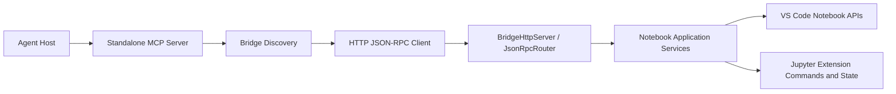

# Jupyter Agentic Bridge Architecture

Jupyter Agentic Bridge exposes the live Jupyter notebook open in a VS Code-compatible editor to external agents through MCP, while keeping the editor notebook model as the only source of truth.

## Product Shape

The system has four parts:

1. A VS Code-compatible extension that owns notebook access and runtime control.
2. A localhost HTTP bridge that exposes notebook operations via JSON-RPC 2.0.
3. A standalone MCP server that discovers the bridge and turns notebook capabilities into MCP tools.
4. An MCP-capable host such as Cursor or another agent environment.

The normal runtime path is:

`Agent Host -> MCP -> frontend-mcp -> localhost JSON-RPC bridge -> extension -> VS Code notebook APIs / Jupyter integration`

## Supported Environment

The current target is intentionally narrow:

- desktop editors that support the stable VS Code extension API
- local file-backed notebooks with `notebookType === "jupyter-notebook"`
- one bridge session per editor window
- single-user local-machine trust boundaries

Out of scope for now:

- VS Code web extensions
- remote SSH, dev container, Codespaces, or tunnel-based extension hosts
- non-file notebook URIs
- non-Jupyter notebook types
- general-purpose editor automation outside the notebook domain

Unsupported environments should fail explicitly instead of silently degrading into partial behavior.

## Core Invariants

These rules are architectural, not implementation details:

- The live `NotebookDocument` in the editor is the authoritative notebook state.
- The project must not create a shadow notebook model outside the editor host.
- If the bridge reports that a cell changed or executed, the user-visible notebook must reflect the same state.
- Execution results returned to the agent must come from the live notebook output model.
- Cells are addressed by stable `cell_id` values, not only by positional indices.
- Transport choices are replaceable. Notebook logic must not depend on HTTP or JSON-RPC details.
- Frontends are replaceable. MCP is primary, but notebook-domain services must not depend on MCP-specific assumptions.

## Repository Mapping

### `packages/notebook-domain/`

Shared pure notebook policy:

- kernel runtime transitions and readiness rules
- execution completion policy
- outline extraction
- cell preview shaping
- search preparation and matching
- variable normalization and paging
- workflow orchestration: topological step ordering and DAG execution with error policy

This package must stay free of `vscode`, MCP, HTTP, and bridge concerns. It operates on immutable snapshots and value objects only.

### `packages/protocol/`

Shared contracts and durable wire-level primitives:

- notebook/domain request and result types
- JSON-RPC method names
- session discovery record types and helpers
- shared error codes

### `extension/`

Editor-hosted implementation:

- `src/notebook/` for notebook application services and VS Code/Jupyter adapters
- `src/bridge/` for the localhost HTTP server, auth, routing, rendezvous, and project port files
- `src/commands/` for wrapping VS Code command surfaces
- `src/cursor/` for Cursor-specific MCP registration
- `src/extension.ts` as the composition root

### `frontend-mcp/`

Standalone MCP adapter:

- `src/bridge/` for discovery and the typed JSON-RPC client
- `src/mcp/` for tool catalog, parsing, and result rendering
- `src/main.ts` for MCP process startup

## Runtime Topology



## Responsibility Split

### Extension

The extension is the only component allowed to touch live notebook state. Its responsibilities are:

- enumerate open and visible notebooks
- open notebooks on demand
- ensure stable cell IDs exist
- project live editor state into immutable snapshots for the domain package
- read notebook snapshots, previews, outlines, diagnostics, symbols, and outputs
- normalize editor-native output items into transport-safe output records, including extracting embedded image MIME payloads from rich vendor bundles when the live notebook output already carries them
- apply notebook mutations through VS Code notebook edit APIs
- execute cells and observe completion
- inspect and control kernel state through public editor/Jupyter command surfaces
- write editor- or host-local MCP configuration files that bind the bundled MCP server to the preferred project port file
- expose all of the above through the local bridge

### Local Bridge

The bridge is a transport boundary, not a second domain layer. Its responsibilities are:

- bind an authenticated HTTP endpoint on `127.0.0.1`
- expose JSON-RPC 2.0 methods at `POST /rpc`
- validate auth and route requests to the typed notebook services
- return domain errors consistently

### MCP Frontend

The MCP server is an adapter. It must not own notebook state. Its responsibilities are:

- discover a matching editor bridge session
- authenticate to the bridge
- register tools based on the resolved profile (core or full)
- convert MCP tool calls into typed bridge calls
- expose MCP prompts for guided multi-step workflows
- expose optional MCP resources for passive discovery without changing the underlying notebook model
- expose optional MCP Apps companion views that orchestrate bridge-backed tools without becoming a second notebook frontend (capability-gated behind the full profile)
- delegate workflow step ordering and execution policy to the shared `notebook-domain` orchestration module
- render bridge results into MCP-friendly responses, including compatibility text/image content and typed structured output
- build MCP-only affordances such as resource-local editor navigation links or command bindings from bridge-backed data
- keep MCP-specific metadata such as resource URIs, `outputSchema`, annotations, elicitation policy, and UI resource bindings in the frontend shell
- keep MCP host integration separate from notebook behavior

### Shared Notebook Domain

The shared notebook domain package owns the notebook rules that should behave the same regardless of caller:

- what counts as kernel-ready
- how execution progress is derived from observed cell changes
- how markdown headings become notebook outline sections
- how lightweight previews are shaped for agent navigation
- how notebook text search is prepared and matched
- how raw variable-explorer payloads become stable paged summaries

UI-oriented presentation behavior stays in the extension shell. That includes commands such as revealing cells in the viewport, collapsing cell input, focusing rendered output for demonstration flows, and handling product-scheme URI opens that map to those editor-native actions.

Output adaptation that depends on editor-native notebook item encoding also stays in the extension shell. If a VS Code notebook output item exposes vendor-specific structure such as Plotly JSON with embedded `image/png` or `image/svg+xml` payloads, the extension may project those embedded image payloads into normal transport `image` outputs while preserving the original rich bundle entry. This is still notebook-state projection, not MCP presentation logic.

This keeps Cursor-specific, VS Code-specific, and transport-specific differences in the shell instead of leaking them into notebook policy.

The same shell rule applies to MCP features: progressive-discovery affordances such as MCP resources, typed `outputSchema`, capability-gated elicitation, and MCP Apps UI resources belong to `frontend-mcp`. They must not migrate into the shared protocol or notebook-domain packages unless the change is transport-neutral data that would still make sense without MCP.

### Cursor Integration

Cursor-specific behavior must stay thin and isolated. The extension may register the bundled MCP server through the Cursor MCP API when available, but that integration must not leak into notebook services, protocol types, or bridge behavior.

## Session Discovery And Binding

The MCP server runs out of process, so it must discover the right bridge instance instead of assuming a single editor session.

### Rendezvous Directory

The extension writes one rendezvous record per active editor window to a platform-specific directory:

- macOS: `~/Library/Caches/jupyter-agent-bridge/sessions`
- Linux: `$XDG_STATE_HOME/jupyter-agent-bridge/sessions`, falling back to `~/.local/state/jupyter-agent-bridge/sessions`
- Windows: `%LOCALAPPDATA%\jupyter-agent-bridge\sessions`

Each record is a JSON file named `<session_id>.json` and includes:

- `session_id`
- `workspace_id`
- `workspace_folders`
- `window_title`
- `bridge_url`
- `auth_token`
- `capabilities`
- `pid`
- `created_at`
- `last_seen_at`

Records are refreshed on a heartbeat and considered stale after 15 seconds.

### Project Port File

The extension also writes a project-local port file to each workspace folder:

- `.jupyter-agent-bridge/bridge/port`

This gives hosts and users a stable, workspace-scoped way to pin the bundled MCP server to the active bridge without scanning every session record.

### Generated Local Artifacts

The extension may also write host-specific MCP config files such as `.mcp.json`, `.codex/config.toml`, `.vscode/mcp.json`, or `.cursor/mcp.json` when the user runs `Jupyter Agentic Bridge: Create MCP Config`.

These files are intentionally local-only:

- they embed an absolute path to the built `frontend-mcp` entrypoint in the current checkout
- they reference the workspace-local `.jupyter-agent-bridge/bridge/port` file
- they are setup artifacts, not durable source files

Treat them the same way as the port file and other generated runtime state: keep them untracked, regenerate them per machine, and never treat them as portable checked-in config.

### Session Selection Order

`frontend-mcp` selects a session using this order:

1. explicit port file passed as a CLI argument or `JUPYTER_AGENT_BRIDGE_PORT_FILE`
2. explicit `JUPYTER_AGENT_BRIDGE_SESSION_ID`
3. workspace-folder match against the current process working directory
4. a single remaining active session
5. if ambiguity remains and the MCP client supports elicitation, prompt the user to choose one session and cache that choice for later ambiguous resolutions until the chosen session disappears
6. otherwise fail with `AmbiguousSession`

The frontend must not guess when more than one plausible session exists. Elicitation is only allowed as an explicit user choice for an already-ambiguous selection.

`frontend-mcp` may also maintain an in-process pinned session selected through an MCP tool or MCP Apps chooser. That pin is lower precedence than an explicit port file or `JUPYTER_AGENT_BRIDGE_SESSION_ID`, and it is cleared automatically when the chosen session disappears.

## Security Model

The project assumes a local-machine trust boundary, but still treats the bridge as a protected local service.

- The bridge binds to `127.0.0.1` only.
- Every bridge request uses bearer-token authentication.
- Each editor window gets its own session ID and auth token.
- The bridge only exposes notebooks that belong to the current editor session or were explicitly opened through the bridge.

## Notebook And Concurrency Model

### Notebook Identity

- Primary notebook handle: notebook URI
- Secondary notebook state: notebook type, dirty flag, active editor presence, visible editor count, kernel summary

### Cell Identity

Cells use stable `cell_id` values. These are identity handles, not content hashes. When the notebook format does not already provide a stable ID, the extension persists one under the extension-owned metadata namespace:

```json
{
  "jupyterAgentBridge": {
    "cellId": "c_000017"
  }
}
```

Indices are returned for convenience but are not the primary mutation handle.

Cell reads also expose `source_fingerprint`, which is a short fingerprint of the current cell source. Agents should treat the pair as:

- `cell_id`: stable identity across source edits and moves
- `source_fingerprint`: optimistic state fingerprint for stale-safe reads, edits, definition lookups, and execution requests

Cell-source mutation inputs use normal JSON string semantics and are stored verbatim after decoding. The MCP frontend must not apply a second unescape pass for sequences such as `\n` or `\t`. Any compatibility handling for ambiguous host payloads belongs in the MCP shell, not in the extension notebook services.

### Notebook Versioning

Each open notebook gets an in-memory monotonic `notebook_version`.

- It increments when the editor reports notebook document changes.
- Reads, mutations, and execution responses return the current version.
- Mutating requests may supply `expected_notebook_version`.
- Some cell-targeted requests may also supply expected source fingerprints for optimistic stale checks without a fresh `list_cells` call.
- Version or source-hash mismatches fail with `NotebookChanged`.
- `NotebookChanged.detail` returns fresh `CellSnapshot` values for the mismatched target cells so an agent can retry from current state.
- Missing `cell_id` lookups fail with `CellNotFound` and include structured notebook context such as notebook version, cell count, and a bounded sample of known IDs.

### Mutation Serialization

Writes and executions are serialized per notebook.

- Reads may run concurrently.
- Different notebooks may be mutated concurrently.
- Writes and executions for the same notebook must not overlap.
- The system does not attempt automatic merge behavior between user edits and agent edits.

## Output Normalization And Execution Semantics

### Output Normalization

Outputs are normalized into transport-safe items with these kinds:

- `text`
- `markdown`
- `json`
- `html`
- `image`
- `stdout`
- `stderr`
- `error`
- `unknown`

Normalization keeps MIME types, ordering, and truncation metadata. The current transport limits are:

- up to 200 normalized output items per cell
- up to 64 KiB UTF-8 text per text, markdown, or html item
- up to 256 KiB serialized JSON per json item
- up to 1 MiB raw bytes per image item before base64 encoding

If truncation occurs, the output item carries `truncated`, `original_bytes`, and `returned_bytes`.

Notebook-native stdout, stderr, and structured error payloads are normalized and returned by default. `include_rich_output_text` only gates raw rendered HTML/JS/widget payloads and similar rich vendor bundles. When a rich vendor bundle already contains embedded image MIME payloads, the extension shell may surface those embedded images as normal `image` outputs in addition to the original rich bundle entry.

This extraction belongs in the extension rather than `frontend-mcp` because the decision depends on how the live editor exposes `NotebookCellOutputItem` data, MIME-specific payload encoding, and per-item byte limits before transport. The MCP frontend should only translate already-normalized image outputs into MCP image content; it must not re-interpret vendor bundle internals independently of the editor bridge.

### Execution Rules

- Executing through the bridge must update the visible notebook.
- Editing source changes notebook text only; it does not change kernel state until code cells execute.
- `execute_cells` must correlate returned status and outputs with the targeted notebook cells.
- `execute_cells` remains the synchronous execution surface.
- Async execution uses execution handles exposed through `execute_cells_async`, `get_execution_status`, and `wait_for_execution`.
- Cell-mutating and execution tools expose a simple `reveal_cell` toggle for default cell-following behavior; richer viewport placement and output focus stay on `reveal_notebook_cells` so the edit/execute surfaces keep a boolean-only presentation contract.
- `wait_for_execution.timeout_ms` is a wait bound only. It returns the latest execution snapshot without cancelling the underlying kernel work.
- Interrupting or restarting the kernel remains explicit through `interrupt_execution` and `restart_kernel`.
- Async execution handles are process-local, retain terminal snapshots for 15 minutes, and do not outlive the bridge runtime.
- Per-notebook serialization applies to both synchronous and async executions.
- Per-cell execution status uses normalized terminal states such as `succeeded`, `failed`, `cancelled`, and `timed_out`.

## Public Surfaces

### Extension Commands

The extension currently exposes these user-facing commands:

- `Jupyter Agentic Bridge: Start Bridge`
- `Jupyter Agentic Bridge: Stop Bridge`
- `Jupyter Agentic Bridge: Show Status`
- `Jupyter Agentic Bridge: Create MCP Config`

### Bridge Surface

The bridge method names are defined centrally in [`packages/protocol/src/rpc.ts`](../packages/protocol/src/rpc.ts). The full user-facing API inventory lives in [`README.md`](../README.md).

Editor-state reads are part of the bridge query surface. `notebook.get_editor_state` reports volatile UI state such as active notebook URI, active cell, selected ranges, visible ranges, and best-effort source focus. This belongs in the extension/bridge shell because it depends on VS Code notebook editor state; notebook-domain policy must continue to stay independent of editor focus and viewport APIs.

### MCP Surface

The MCP tool catalog is defined in [`frontend-mcp/src/mcp/NotebookToolCatalog.ts`](../frontend-mcp/src/mcp/NotebookToolCatalog.ts). `README.md` documents the current tool list and intended use.

`get_notebook_editor_state` is the MCP-facing affordance for user-targeted requests such as "this cell" or "the selected cells". It is intentionally separate from `summarize_notebook_state`, which remains a notebook health and kernel summary.

#### Tool Profiles

Tools are split into two profiles controlled by the `JUPYTER_AGENT_BRIDGE_PROFILE` environment variable:

- **core** (default): the full notebook tool catalog. Read, edit, execute, inspect, kernel, navigation, and workflow tools all stay available in the default profile.
- **full**: `core` plus progressive-discovery extras such as read-only MCP resources and MCP Apps companion views.

The profile is resolved once at startup by `resolveToolProfile()`. Profile membership is defined by the `CORE_TOOLS` and `ADVANCED_TOOLS` arrays in the tool catalog.

#### Tool Annotations

Every registered tool carries MCP annotations (`readOnlyHint`, `destructiveHint`, `idempotentHint`, `openWorldHint`) so that hosts can reason about tool safety without parsing descriptions. Annotations are defined per-tool in `TOOL_ANNOTATIONS`.

#### MCP Prompts

The MCP server registers user-invocable prompts for common multi-step workflows:

- `triage_notebook`: assess notebook health via state summary, diagnostics, and output inspection
- `safe_edit_cell`: read current state, apply a fingerprint-guarded edit, verify with diagnostics
- `execute_and_inspect`: execute cells with stop-on-error, inspect outputs, report results
- `recover_kernel`: diagnose stuck kernel, interrupt, restart if needed, confirm recovery

Prompts are defined in [`frontend-mcp/src/mcp/NotebookPrompts.ts`](../frontend-mcp/src/mcp/NotebookPrompts.ts). They are always registered; they are not gated behind the `full` profile.

#### Discovery Layers

The MCP shell exposes five additive discovery layers:

- notebook tools as the universal interface for all clients
- tool annotations for host-side safety reasoning
- typed tool `outputSchema` and `structuredContent` for clients that support structured tool results
- read-only MCP resources for passive notebook discovery (cell resources are template-only, not eagerly enumerated)
- MCP Apps companion views for host-rendered human review and orchestration (capability-gated behind the `full` profile)

The current MCP Apps layer uses one shared HTML resource, `ui://jupyter-agent-bridge/notebook-console.html`, behind additive launcher tools for:

- bridge session selection
- cell code preview with live notebook reveal actions
- replace/patch change review
- async execution monitoring
- notebook triage across diagnostics, search, and symbols
- normalized cell-output preview plus live notebook reveal/export helpers

These views remain thin: they call existing bridge-backed tools, and they must not introduce notebook-only state or alternate mutation logic in the browser. Read-only MCP resources stay action-free; app surfaces are the place for host-rendered snippets and explicit navigation controls such as "go to cell" or "reveal output".

Tools remain primary. Resources and structured output must never become mandatory for basic notebook use.

## Testing Expectations

The long-term test priorities are:

- unit tests for output normalization, cell ID persistence, execution completion policy, JSON-RPC routing, auth, discovery, and error mapping
- integration tests for the end-to-end editor-to-bridge flow
- MCP tests for startup, discovery, ambiguity handling, and tool invocation
- manual checks for multi-workspace sessions, execution errors, image outputs, kernel controls, bridge token handling, and Cursor bundled MCP registration

## Change Management Rules

The following changes are architectural and must be documented in the same change:

- notebook metadata namespace changes
- bridge auth, discovery, or rendezvous behavior changes
- project port file layout changes
- MCP tool or bridge method contract changes
- install/setup workflow changes
- editor compatibility or supported-environment changes

Keep [`README.md`](../README.md), this document, and [`AGENTS.md`](../AGENTS.md) aligned whenever those surfaces move.
